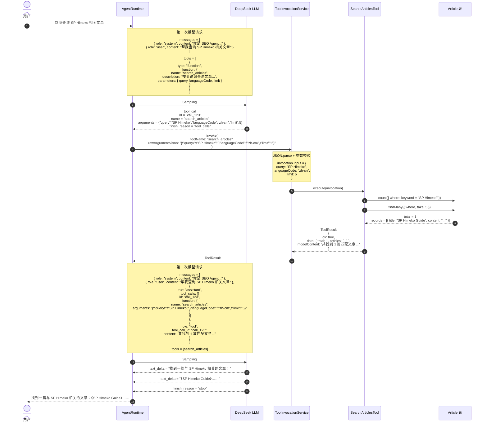

```mermaid
sequenceDiagram
    autonumber

    actor U as 用户
    participant R as AgentRuntime
    participant L as DeepSeek LLM
    participant I as ToolInvocationService
    participant E as SearchArticlesTool
    participant DB as Article 表

    U->>R: 帮我查询 SP Himeko 相关文章

    Note over R,L: 第一次模型请求<br/><br/>messages = [<br/>  { role: "system", content: "你是 SEO Agent..." },<br/>  { role: "user", content: "帮我查询 SP Himeko 相关文章" }<br/>]<br/><br/>tools = [<br/>  {<br/>    type: "function",<br/>    function: {<br/>      name: "search_articles",<br/>      description: "按关键词查询文章...",<br/>      parameters: { query, languageCode, limit }<br/>    }<br/>  }<br/>]

    R->>L: Sampling #1

    L-->>R: tool_call<br/>id = "call_123"<br/>name = "search_articles"<br/>arguments = {"query":"SP Himeko","languageCode":"zh-cn","limit":5}<br/>finish_reason = "tool_calls"

    R->>I: invoke(<br/>  toolName: "search_articles",<br/>  rawArgumentsJson: "{\"query\":\"SP Himeko\",\"languageCode\":\"zh-cn\",\"limit\":5}"<br/>)

    Note over I: JSON.parse + 参数校验<br/><br/>invocation.input = {<br/>  query: "SP Himeko",<br/>  languageCode: "zh-cn",<br/>  limit: 5<br/>}

    I->>E: execute(invocation)

    E->>DB: count({ where: keyword = "SP Himeko" })
    E->>DB: findMany({ where, take: 5 })

    DB-->>E: total = 1<br/>records = [{ title: "SP Himeko Guide", content: "..." }]

    E-->>I: ToolResult<br/>{<br/>  ok: true,<br/>  data: { total: 1, articles: [...] },<br/>  modelContent: "共找到 1 篇匹配文章..."<br/>}

    I-->>R: ToolResult

    Note over R,L: 第二次模型请求<br/><br/>messages = [<br/>  { role: "system", content: "你是 SEO Agent..." },<br/>  { role: "user", content: "帮我查询 SP Himeko 相关文章" },<br/>  {<br/>    role: "assistant",<br/>    tool_calls: [{<br/>      id: "call_123",<br/>      function: {<br/>        name: "search_articles",<br/>        arguments: "{\"query\":\"SP Himeko\",\"languageCode\":\"zh-cn\",\"limit\":5}"<br/>      }<br/>    }]<br/>  },<br/>  {<br/>    role: "tool",<br/>    tool_call_id: "call_123",<br/>    content: "共找到 1 篇匹配文章..."<br/>  }<br/>]<br/><br/>tools = [search_articles]

    R->>L: Sampling #2

    L-->>R: text_delta = "找到一篇与 SP Himeko 相关的文章："
    L-->>R: text_delta = "《SP Himeko Guide》……"
    L-->>R: finish_reason = "stop"

    R-->>U: 找到一篇与 SP Himeko 相关的文章：《SP Himeko Guide》……
```